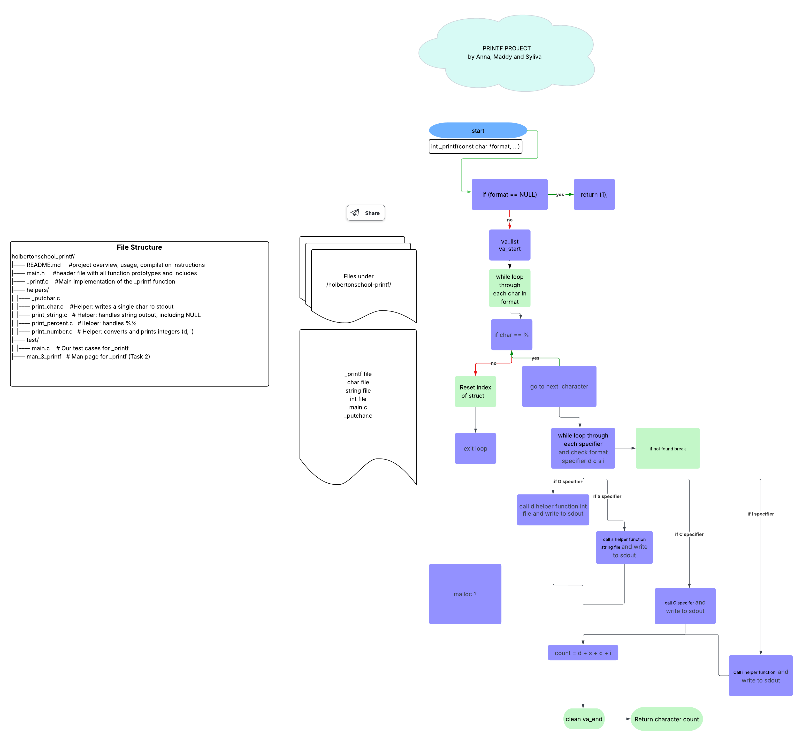

# _printf - Custom printf Function in C

This project is a simplified implementation of the C standard library function `printf'.
It is designed to demonstrate understanding of variadic functions, low-level string manipulation, and output formatting in C.

---

## Features

The `_printf` function supports the following conversion specifiers:

| Specifier | Output                          |
|-----------|----------------------------------|
| `%c`      | Character                        |
| `%s`      | String (handles NULL as "(null)")|
| `%%`      | A percent sign                   |
| `%d`, `%i`| Signed decimal integer           |

> Future extensions may include `%u`, `%o`, `%x`, `%X`, `%p`, `%r`, `%R` etc.

---

## 📊 Flowchart

The following diagram shows the flow of the `_printf` function:



---

## File Structure
<pre>
holbertonschool_printf/
├── README.md          # Project overview, usage, compilation instructions
├── main.h             # Header file with all function prototypes and includes
├── _printf.c          # Main implementation of the _printf function
├── helpers/           # Folder for helper functions
│   ├── _putchar.c     # Writes a single char to stdout
│   ├── print_char.c   # Handles %c: character output
│   ├── print_string.c # Handles %s: string output (NULL-safe)
│   ├── print_percent.c# Handles %%: prints percent symbol
│   └── print_number.c # Handles %d and %i: integer output
├── test/              # Custom test directory
│   └── main.c         # Test cases for _printf
└── man_3_printf       # Man page for _printf (Task 2)
</pre>
---

## Compilation

To compile the project, use the following command:
- gcc -Wall -Werror -Wextra -pedantic -std=gnu89 .c helpers/.c -o printf_exec

---

## Usage Example

```c
_printf("Hello, %s! Your score is %d%% on your group project.\n", "AnnaMaddySylvia", 100);

Output:
Hello, AnnaMaddySylvia! Your score is 100% on your group project.
```

---

## Authorized Functions and Macros

- write
- va_start, va_arg, va_end, va_copy
- malloc, free

---

## Authors

- Anna [https://github.com/Anna-Halaapiapi](https://github.com/Anna-Halaapiapi)
- Madison [https://github.com/madisonfleming](https://github.com/madisonfleming)
- Sylvia [https://github.com/shihuaxie](https://github.com/shihuaxie)

