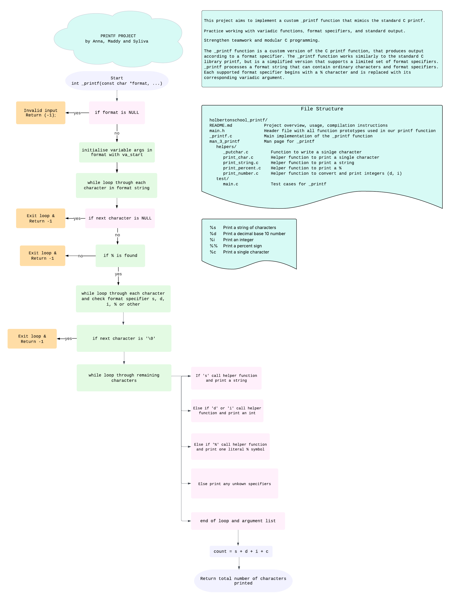

# 🖨️ holbertonschool-printf

Welcome to the `_printf` project – a simplified custom version of the C `printf` function! 
This project is part of the **Low-Level Programming** curriculum at Holberton School.

# 📚 _printf Description - Custom printf Function in C

This project aims to:
- Implement a custom `_printf` function that mimics the standard C `printf`
- Practice working with `variadic functions`, format specifiers, and standard output
- Strengthen teamwork and modular C programming 🧠
---

## 🛠️ Features

The `_printf` function supports the following conversion specifiers:

| Specifier | Output                          |
|-----------|----------------------------------|
| `%c`      | Character                        |
| `%s`      | String (handles NULL as "(null)")|
| `%%`      | A percent sign                   |
| `%d`, `%i`| Signed decimal integer           |

> Future extensions may include `%u`, `%o`, `%x`, `%X`, `%p`, `%r`, `%R` etc.

---

## 📊 Flowchart

The following diagram shows the flow of the `_printf` function:



---

## 📂 File Structure
<pre>
holbertonschool_printf/
├── README.md          # Project overview, usage, compilation instructions
├── main.h             # Header file with all function prototypes and includes
├── _printf.c          # Main implementation of the _printf function
├── helpers/           # Folder for helper functions
│   ├── _putchar.c     # Writes a single char to stdout
│   ├── print_char.c   # Handles %c: character output
│   ├── print_string.c # Handles %s: string output (NULL-safe)
│   ├── print_percent.c# Handles %%: prints percent symbol
│   └── print_numbers.c # Handles %d and %i: integer output
├── test/              # Custom test directory
│   └── main.c         # Test cases for _printf
├── images/            # Assets for readme
└── man_3_printf       # Man page for _printf (Task 2)
</pre>
---

## 🔧 How to Compile

To compile the project, run:

```bash
gcc -Wall -Wextra -Werror -pedantic -I. _printf.c helpers/*.c test/main.c -o printf_test
```
---

## 🧩 Usage Example

```c
_printf("Hello, %s! Your score is %d%% on your group project.\n", "AnnaMaddySylvia", 100);

Output:
Hello, AnnaMaddySylvia! Your score is 100% on your group project.
```

---

## ✅ Authorized Functions and Macros

- write
- va_start, va_arg, va_end, va_copy
- malloc, free

---

## 🤝 Authors

- Anna [https://github.com/Anna-Halaapiapi](https://github.com/Anna-Halaapiapi)
- Madison [https://github.com/madisonfleming](https://github.com/madisonfleming)
- Sylvia [https://github.com/shihuaxie](https://github.com/shihuaxie)

---

## 🧪 Testing
Run:
```bash
./printf_test
```
Check outputs for:
- %c, %s, %%, %d, %i
- NULL handling and edge cases

---
## 🚀 GitHub Repo
[https://github.comshihuaxie/holbertonschool-printf.git](https://github.com/shihuaxie/holbertonschool-printf)


